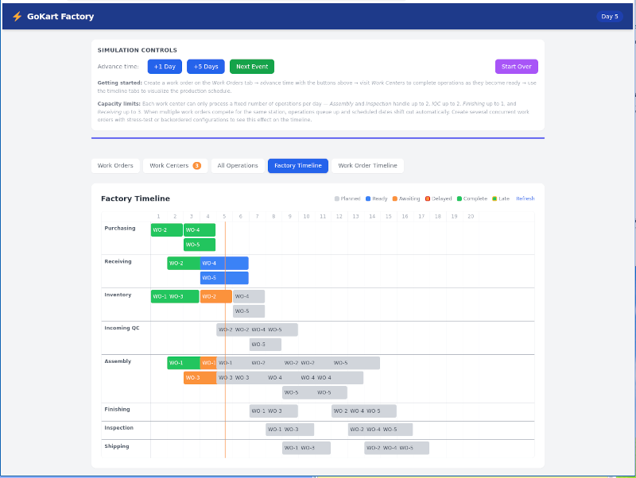

# GoKart Factory



A (mostly) AI generated manufacturing simulation for a custom electric go-kart factory.

> Have a look at the [**LIVE DEMO**](http://www.hovind.com/demos/gokart-factory)


### AI Generated
I wanted to make another demo for my site. I had worked on a manufacturing tracking (MRP type) app recently and thought it might make a good demo.

Due to the complexity I wanted to see how well AI could handle a project like this.

This project started with the "prompt". Since it was going to be a demo of AI code, it seemed best to speak in an AI language. Hence, an AI chat was used to describe the project, fine tune requirements, and generate the prompt. The prompt can be seen in the file 'project.prompt'

Once the prompt was generated it was fed to Claude Code. And in one pass there was a working demo. Claude interpreted the prompt as a non-production project. This resulted in some things being hard coded. Once Claude was instructed to build it as if it would be for production, Claude corrected those items and moved them into the database. The outcome was as requested, no errors. The Initial Commit is what was generated from the prompt, untouched.

The Timelines were added by chatting with Claude. Again, they came out correctly, first pass. The only thing changed was the addition of some styling. Claude couldn't "see" what would make it easier for a human to view.

Oddly, the ICQ stage was not displayed in the Work Centers. It was properly handled in the DB and the Scheduler, it just wasn't visible which could cause some confusion for a User. Once this was pointed out Claude corrected that quickly.

Aside from some cosmetic items, the code is what Claude output. You can crtitque it. As can be seen from my other projects, Claude structured some things differently than I would have. A better prompt would have guided it more toward my style of coding. But, the code is discernable and well commented. I have had to maintain much worse.

What you're looking at took less than two (2) work days, to go from concept to deployable code. "That'll do Claude, that'll do."

> Update: adding tests was an additional day's work.

## Tech Stack

- **Backend**: FastAPI + SQLAlchemy + SQLite
- **Frontend**: Vue 3 + Vite + Pinia + Tailwind CSS
- **Auth**: Anonymous tenants via JWT (one per browser session)

---

## Local Development

### Backend

```bash
cd backend
pip install -r requirements.txt
uvicorn app.main:app --reload --port 8000
```

API available at `http://localhost:8000/docs`

### Frontend

```bash
cd frontend
npm install
npm run dev
```

App available at `http://localhost:5173` (proxies `/api` → FastAPI)

---

## Production (Docker)

```bash
docker compose up --build
```

App available at `http://localhost:8000`

The multi-stage Dockerfile builds the Vue frontend, then serves it via FastAPI's static file middleware.

SQLite database is persisted to `./data/gokart.db` via a Docker volume.

---

## How It Works

1. **On first load** — the frontend calls `POST /api/init` to create an anonymous tenant and stores the JWT in `localStorage`.
2. **Create a Work Order** — pick frame, motor, battery, and finish options. The backend expands this into 10 manufacturing operations and schedules them.
3. **Advance time** — use the +1 Day, +5 Days, or "Next Event" buttons to move the factory clock forward. Operations transition: `planned → ready → awaiting_completion`.
4. **Complete operations** — go to the Work Centers tab and click "Complete" on any `Awaiting` operation. Inspection operations run a deterministic failure check; failures insert a rework + retest pair and reschedule.
5. **View timelines** — the Work Order Timeline shows per-order operation schedules; the Factory Timeline displays a Gantt chart of all work orders across work centers.

---

## Project Structure

```
gokart-factory/
├── backend/
│   ├── app/
│   │   ├── main.py        # FastAPI app, routes, static file serving
│   │   ├── database.py    # SQLAlchemy engine + session
│   │   ├── models.py      # ORM models (SimulationState, WorkOrder, Operation)
│   │   ├── schemas.py     # Pydantic request/response models
│   │   ├── services.py    # Business logic
│   │   ├── scheduler.py   # Capacity-aware dependency scheduling
│   │   └── auth.py        # JWT generation and validation
│   ├── tests/
│   │   ├── conftest.py             # Fixtures: in-memory DB, auth client
│   │   ├── test_scheduler.py       # Pure unit tests (no DB)
│   │   ├── test_services.py        # Service layer tests
│   │   ├── test_routes_auth.py     # Auth and admin endpoint tests
│   │   ├── test_routes_simulation.py
│   │   ├── test_routes_workorders.py
│   │   ├── test_routes_operations.py
│   │   ├── test_routes_inventory.py
│   │   └── test_multi_tenant.py    # Tenant isolation tests
│   ├── pytest.ini
│   └── requirements.txt
├── frontend/
│   ├── src/
│   │   ├── App.vue
│   │   ├── api.js         # Axios + JWT interceptor
│   │   ├── stores.js      # Pinia: auth, sim, ops
│   │   └── components/
│   │       ├── SimulationControls.vue
│   │       ├── WorkOrderCreator.vue
│   │       ├── WorkCenterView.vue
│   │       ├── OperationTable.vue
│   │       ├── WorkOrderTimeline.vue
│   │       ├── FactoryTimeline.vue
│   │       └── StatusBadge.vue
│   └── ...
├── e2e/
│   └── tests/             # Playwright end-to-end tests
├── scripts/
│   ├── OpenRC/            # OpenRC service file
│   └── cron/              # DB reset cron script
├── Dockerfile
└── docker-compose.yml
```

---

## Testing

### Backend (pytest)

```bash
cd backend
source venv/bin/activate
pip install -r requirements.txt
pytest
```

Runs 103 tests across unit, integration, and end-to-end API layers with coverage reporting. A coverage HTML report is written to `backend/htmlcov/`.

```bash
venv/bin/pytest -v                              # verbose output
venv/bin/pytest tests/test_scheduler.py        # just the scheduler unit tests
venv/bin/pytest --cov-report=html && open htmlcov/index.html   # visual coverage report
```


### E2E (Playwright)

Requires the full stack running locally (backend on `:8000`, frontend on `:5173`).

```bash
cd e2e
npm install

npm test                # headless
npm run test:headed     # with browser visible
```
